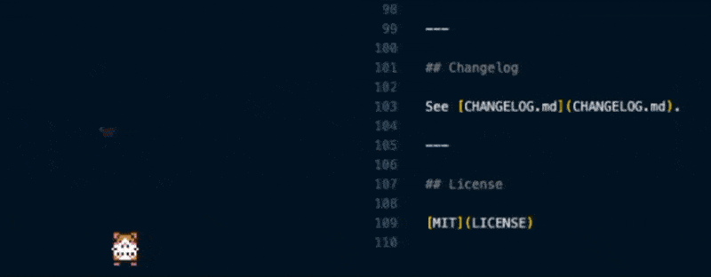

# Run Hamster RunRun🐹

> A tiny hamster lives in your sidebar and runs on a wheel as you type. The faster you code, the faster it runs.



[](https://marketplace.visualstudio.com/items?itemName=miiin.hamster-run)
[](https://marketplace.visualstudio.com/items?itemName=miiin.hamster-run)
[](https://marketplace.visualstudio.com/items?itemName=miiin.hamster-run)

[Report a bug](https://github.com/miiin/run-hamster-run/issues/new) · [Request a feature](https://github.com/miiin/run-hamster-run/issues/new)

> Replace the demo image above with an actual capture (`images/demo.gif`).

---

## Install

There are three ways to install Run Hamster Run.

**1. From the Visual Studio Marketplace**

Visit the [Run Hamster Run page](https://marketplace.visualstudio.com/items?itemName=miiin.hamster-run) and click **Install**.

**2. From the Extensions panel inside VS Code**

Open the Extensions panel (`Cmd+Shift+X` / `Ctrl+Shift+X`), search for **Run Hamster Run**, and click **Install**.

**3. From Quick Open**

Press `Cmd+P` / `Ctrl+P`, paste the line below, and hit Enter:

```
ext install miiin.run-hamster-run
```

---

## Usage

1. Click the hamster icon in the activity bar to open the side panel
2. Code as you normally would — the wheel reacts automatically to your typing
3. To feed the hamster, **click** anywhere inside the panel; a sunflower seed drops at that spot
4. The hamster walks over, sits down to eat, then leaves a heart behind

---

## Features

- **Typing-driven wheel** — wheel speed scales with your real-time typing speed
- **Natural idle behavior** — when you stop typing, the hamster wanders, occasionally sits to rest
- **Click to feed** — drop a seed anywhere; the hamster will go get it
- **Heart reward** — a heart pops above the hamster's head after each meal
- **Hidden easter eggs** — see below

---

## Settings

Configure these in your `settings.json`:

| Setting                    | Default | Description                                                            |
| -------------------------- | ------- | ---------------------------------------------------------------------- |
| `hamsterRun.idleThreshold` | `0.2`   | Below this cps (characters per second), the hamster is considered idle |
| `hamsterRun.windowMs`      | `2000`  | Sliding window length (ms) used to compute typing speed                |

Example:

```json
{
  "hamsterRun.idleThreshold": 0.5,
  "hamsterRun.windowMs": 1500
}
```

---

## Easter Eggs

Half the fun is finding them yourself, so here are only hints:

- **FEVER** — Type fast enough to set your fingers on fire
- **???** — Click the panel to give it focus, then enter the cheat code every 80s gamer knows

---

## Known Limitations

- The hamster lives only inside the webview panel (it doesn't roam your editor)
- The activity bar icon is currently a PNG, so it may blend into some themes

---

## Credits

- Hamster sprites and animations: original artwork created for this extension
- Inspired by playful pet extensions like [vscode-pets](https://github.com/tonybaloney/vscode-pets) and [vscode-pokemon](https://github.com/jakobhoeg/vscode-pokemon)

---

## Changelog

See [CHANGELOG.md](CHANGELOG.md).

---

## Development

Want to hack on Run Hamster Run locally? Here's the setup.

**Prerequisites**

- [Node.js](https://nodejs.org/) 18+ and npm
- [Visual Studio Code](https://code.visualstudio.com/) 1.85+

**Run the extension locally**

```bash
git clone https://github.com/miiin/run-hamster-run.git
cd run-hamster-run
npm install
npm run watch
```

Then open the project in VS Code and press `F5` (or run **"Run Extension"** from the Run and Debug panel). A new Extension Development Host window will launch with the extension loaded — open the Explorer sidebar to see the **Hamster** panel.

**Project layout**

- `src/extension.ts` — extension entry point (activation, webview wiring)
- `media/` — webview HTML/CSS/JS, sprites, and animations
- `package.json` — extension manifest (commands, views, settings)

**Contributing**

Bug reports and PRs are welcome. For non-trivial changes, please [open an issue](https://github.com/miiin/run-hamster-run/issues/new) first to discuss the approach.

---

## License

[MIT](LICENSE)
